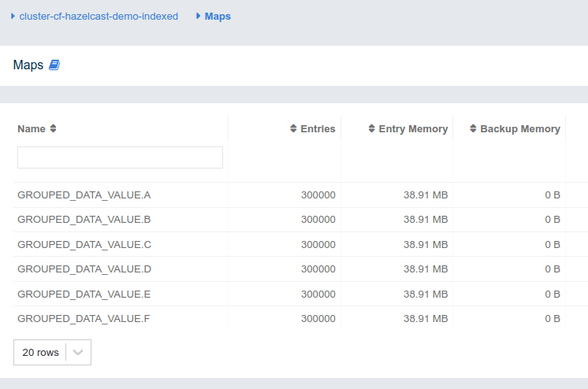
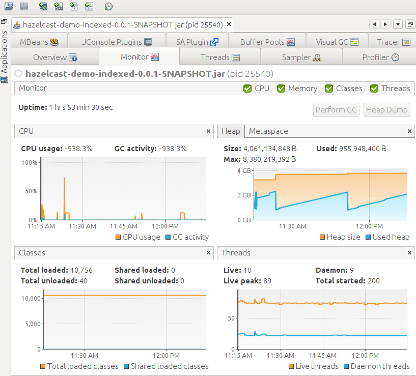
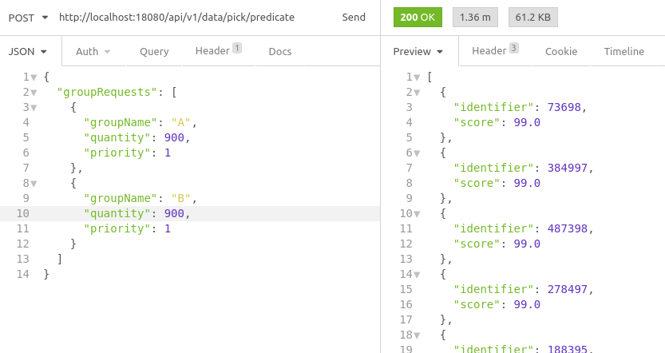
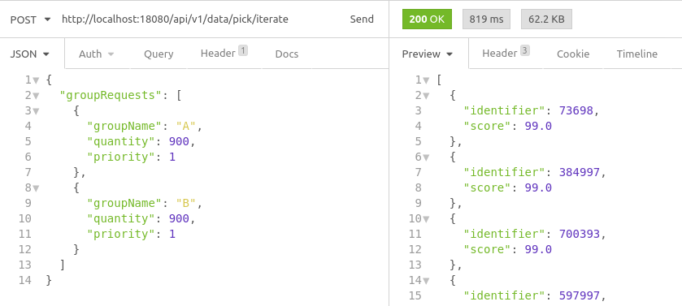
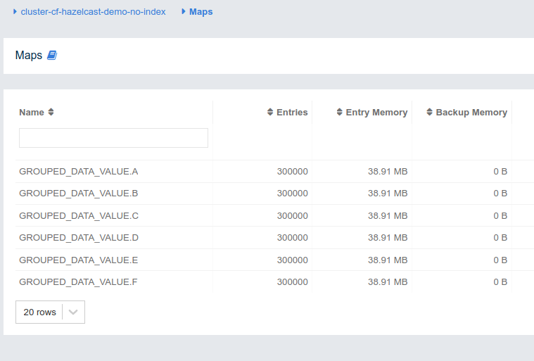
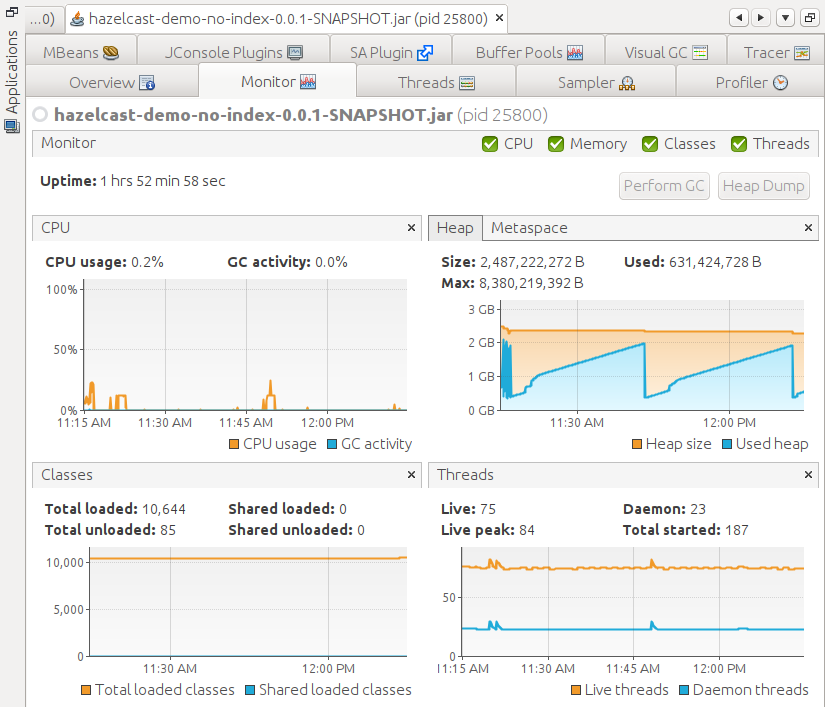
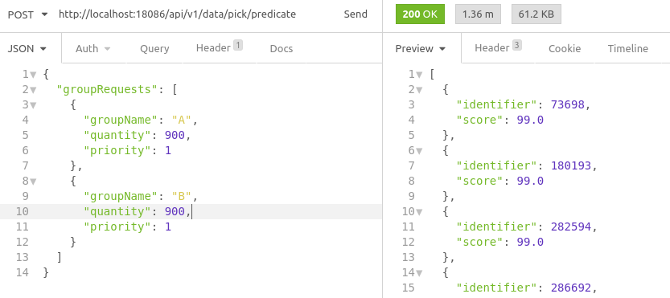
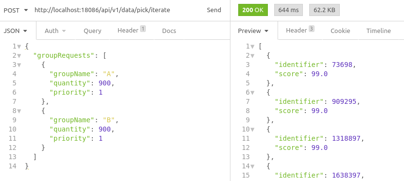

# hazelcast-spring-boot-sample

Here I have modules with same code but 2 different Hazelcast configurations. 

* hazelcast-demo-no-index
* hazelcast-demo-indexed

Both are spring boot application with 

* spring-boot: 2.3.3.RELEASE
* hazelcast: 4.0.2

```
<dependency>
    <groupId>com.hazelcast</groupId>
    <artifactId>hazelcast</artifactId>
    <version>4.0.2</version>
</dependency>
```

## Data model

### Data class (Not in cache)

```
package com.consolefire.demo.hazelcast.core;


import java.io.IOException;
import java.io.Serializable;
import java.util.Objects;

import com.fasterxml.jackson.annotation.JsonCreator;
import com.fasterxml.jackson.annotation.JsonIgnore;
import com.fasterxml.jackson.annotation.JsonProperty;
import com.hazelcast.nio.ObjectDataInput;
import com.hazelcast.nio.ObjectDataOutput;
import com.hazelcast.nio.serialization.IdentifiedDataSerializable;

import lombok.Getter;
import lombok.ToString;

@Getter
@ToString
public class Data implements IdentifiedDataSerializable, Serializable, Comparable<Data> {

    private static final long serialVersionUID = 9170460399133849831L;
    private Long identifier;
    private Double score;


    @JsonCreator
    public Data(@JsonProperty(value = "identifier", required = true) Long identifier,
            @JsonProperty(value = "score", required = true) Double score) {
        this.identifier = identifier;
        this.score = score;
    }

    @Override
    public boolean equals(Object o) {
        if (this == o) {
            return true;
        }
        if (!(o instanceof Data)) {
            return false;
        }
        Data that = (Data) o;
        return identifier.equals(that.identifier);
    }

    @Override
    public int hashCode() {
        return Objects.hash(identifier);
    }

    @Override
    @JsonIgnore
    public int getFactoryId() {
        return 1001;
    }

    @Override
    @JsonIgnore
    public int getClassId() {
        return 1002;
    }

    @Override
    public void writeData(ObjectDataOutput out) throws IOException {
        out.writeLong(identifier);
        out.writeDouble(score);
    }

    @Override
    public void readData(ObjectDataInput in) throws IOException {
        identifier = in.readLong();
        score = in.readDouble();
    }

    @Override
    public int compareTo(Data y) {
        if (y == null) {
            return 1;
        }
        if (this.equals(y)) {
            return 0;
        }
        if (score.equals(y.score)) {
            return 1;
        }
        return y.score.compareTo(this.score);
    }
}
```

### Simple cache `IMap<Long, Double>`

All IMap names are prefixed to `GROUPED_DATA_VALUE.`. Then there are 6 groups: `["A", "B", "C", "D", "E", "F"]`. So there would be 6 `IMap`s created in hazelcast.


### `FastAccessCache.java`

```
package com.consolefire.demo.hazelcast.core;

import java.util.Collection;
import java.util.Comparator;
import java.util.HashSet;
import java.util.Map;
import java.util.Set;
import java.util.stream.Collectors;

import org.springframework.stereotype.Component;
import org.springframework.util.CollectionUtils;

import com.hazelcast.map.IMap;
import com.hazelcast.query.PagingPredicate;
import com.hazelcast.query.PredicateBuilder;
import com.hazelcast.query.PredicateBuilder.EntryObject;
import com.hazelcast.query.Predicates;
import com.hazelcast.query.impl.PredicateBuilderImpl;

import lombok.NonNull;
import lombok.RequiredArgsConstructor;
import lombok.extern.slf4j.Slf4j;

@Slf4j
@Component
@RequiredArgsConstructor
public class FastAccessCache {

    public static final Comparator<Map.Entry<Long, Double>> ENTRY_COMPARATOR = new SimpleKeyValueComparator();

    private final HazelcastObjectFactory hazelcastObjectFactory;

    public static String groupToMapName(@NonNull String groupName) {
        return "GROUPED_DATA_VALUE." + groupName.toUpperCase();
    }

    public Data add(@NonNull String groupName, @NonNull Data data) {
        final IMap<Long, Double> leadMap = hazelcastObjectFactory.getMap(groupToMapName(groupName));
        leadMap.put(data.getIdentifier(), data.getScore());
        return data;
    }

    public Set<Data> getTopDataByScoreWithPredicate(String groupName, int limit, Set<Long> excluding) {

        final IMap<Long, Double> leadMap = hazelcastObjectFactory.getMap(groupToMapName(groupName));

        Long[] excludeArray = new Long[] {};
        if (!CollectionUtils.isEmpty(excluding)) {
            excludeArray = excluding.toArray(new Long[0]);
        }

        EntryObject entryObject = new PredicateBuilderImpl().getEntryObject();
        PredicateBuilder builder = entryObject.key().in(excludeArray);

        PagingPredicate<Long, Double> predicate =
                Predicates.pagingPredicate(Predicates.not(builder), ENTRY_COMPARATOR, limit);

        Set<Data> picked = new HashSet<>();
        log.info("#### Picking started for group {} >@> {}", groupName, System.currentTimeMillis());
        Collection<Map.Entry<Long, Double>> selectedData = leadMap.entrySet(predicate);
        log.info("####  Picking completed for group {} << {}", groupName, System.currentTimeMillis());
        if (!CollectionUtils.isEmpty(selectedData)) {
            Set<Data> pickedAtPage = selectedData.stream().map(entry -> new Data(entry.getKey(), entry.getValue()))
                    .collect(Collectors.toSet());
            picked.addAll(pickedAtPage);
        }

        return picked;
    }


    public Set<Data> getTopDataByScoreWithoutPredicate(String groupName, int limit, Set<Long> excluding) {
        final IMap<Long, Double> leadMap = hazelcastObjectFactory.getMap(groupToMapName(groupName));
        Set<Data> picked = new HashSet<>();
        log.info("#### Picking started for group {} >@> {}", groupName, System.currentTimeMillis());
        Collection<Data> selectedData = leadMap.entrySet().parallelStream().sorted(ENTRY_COMPARATOR)
                .filter(entry -> !excluding.contains(entry.getKey()))
                .limit(limit)
                .map(entry -> new Data(entry.getKey(), entry.getValue())).collect(Collectors.toSet());
        log.info("####  Picking completed for group {} << {}", groupName, System.currentTimeMillis());
        if (!CollectionUtils.isEmpty(selectedData)) {
            picked.addAll(selectedData);
        }
        return picked;
    }
}

```

### `ENTRY_COMPARATOR`

```
package com.consolefire.demo.hazelcast.core;

import java.io.Serializable;
import java.util.Comparator;
import java.util.Map;

public final class SimpleKeyValueComparator implements Comparator<Map.Entry<Long, Double>>, Serializable {
    @Override
    public int compare(Map.Entry<Long, Double> x, Map.Entry<Long, Double> y) {
        if (x == null) {
            return -1;
        }
        if (y == null) {
            return 1;
        }
        if (x.getKey().equals(y.getKey())) {
            return 0;
        }
        return y.getValue().compareTo(x.getValue());
    }
}
```


## APIs

```
@RequestMapping("/api/v1/data")
public class DataController {


    private final FastAccessCache fastAccessCache;

    @PostMapping("/create")
    public Data create(@RequestBody DataPostDto dataPostDto) {
        return fastAccessCache.add(dataPostDto.getGroupName(), dataPostDto.getData());
    }

    @PostMapping("/pick/predicate")
    public Collection<Data> pickWithPredicate(@RequestBody LeadPickRequest pickRequest) {
        List<GroupLeadPickRequest> groupLeadPickRequests =
                pickRequest.getGroupRequests().stream().sorted().collect(Collectors.toList());
        final Set<Data> pickList = new HashSet<>();
        final Set<Long> pickedCustomerList = new HashSet<>();
        groupLeadPickRequests.forEach(request -> {
            String groupName = request.getGroupName();
            Set<Data> pickListByGroup = fastAccessCache.getTopDataByScoreWithPredicate(groupName, request.getQuantity(),
                    pickedCustomerList);
            if (null != pickListByGroup) {
                pickList.addAll(pickListByGroup);
            }
            pickedCustomerList.addAll(pickList.stream().map(Data::getIdentifier).collect(Collectors.toSet()));
        });
        return pickList;
    }

    @PostMapping("/pick/iterate")
    public Collection<Data> pickWithoutPredicate(@RequestBody LeadPickRequest pickRequest) {
        List<GroupLeadPickRequest> groupLeadPickRequests =
                pickRequest.getGroupRequests().stream().sorted().collect(Collectors.toList());
        final Set<Data> pickList = new HashSet<>();
        final Set<Long> pickedCustomerList = new HashSet<>();
        groupLeadPickRequests.forEach(request -> {
            String groupName = request.getGroupName();
            Set<Data> pickListByGroup = fastAccessCache.getTopDataByScoreWithoutPredicate(groupName,
                    request.getQuantity(), pickedCustomerList);
            if (null != pickListByGroup) {
                pickList.addAll(pickListByGroup);
            }
            pickedCustomerList.addAll(pickList.stream().map(Data::getIdentifier).collect(Collectors.toSet()));
        });
        return pickList;
    }
}
```


#### Using `PagingPredicate<Long, Double>`

URL: `POST => http://server:port/api/v1/data/pick/predicate`

Payload:
```
{
  "groupRequests": [
    {
      "groupName": "A",
      "quantity": 900,
      "priority": 1
    },
		{
      "groupName": "B",
      "quantity": 900,
      "priority": 1
    }
  ]
}
```
#### Using simple java `Map.stream`

URL: `POST => http://server:port/api/v1/data/pick/iterate`

Payload:
```
{
  "groupRequests": [
    {
      "groupName": "A",
      "quantity": 900,
      "priority": 1
    },
		{
      "groupName": "B",
      "quantity": 900,
      "priority": 1
    }
  ]
}
```


## Config

### hazelcast-demo-no-index config

```
<hazelcast xmlns="http://www.hazelcast.com/schema/config"
	xmlns:xsi="http://www.w3.org/2001/XMLSchema-instance"
	xsi:schemaLocation="http://www.hazelcast.com/schema/config http://www.hazelcast.com/schema/config/hazelcast-config-4.0.xsd">
	<cluster-name>cluster-cf-hazelcast-demo-no-index</cluster-name>
	<management-center scripting-enabled="false" />
	<security enabled="false">
		<client-block-unmapped-actions>true</client-block-unmapped-actions>
	</security>
	...
	<map name="GROUPED_DATA_VALUE.*">
		<in-memory-format>BINARY</in-memory-format>
		<statistics-enabled>true</statistics-enabled>
		<cache-deserialized-values>INDEX-ONLY</cache-deserialized-values>
		<backup-count>0</backup-count>
		<async-backup-count>2</async-backup-count>
		<time-to-live-seconds>0</time-to-live-seconds>
		<max-idle-seconds>0</max-idle-seconds>
		<merge-policy batch-size="100">com.hazelcast.spi.merge.PutIfAbsentMergePolicy</merge-policy>
		<read-backup-data>true</read-backup-data>
		<metadata-policy>CREATE_ON_UPDATE</metadata-policy>
		<eviction size="2147483647" max-size-policy="PER_NODE"
			eviction-policy="NONE" />
		<merkle-tree enabled="false">
			<depth>10</depth>
		</merkle-tree>
		<event-journal enabled="false">
			<capacity>10000</capacity>
			<time-to-live-seconds>0</time-to-live-seconds>
		</event-journal>
		<hot-restart enabled="false">
			<fsync>false</fsync>
		</hot-restart>
		<map-store enabled="false" initial-mode="LAZY">
			<write-delay-seconds>0</write-delay-seconds>
			<write-batch-size>1</write-batch-size>
		</map-store>
		<!-- <indexes>
			<index type="HASH">
				<attributes>
					<attribute>__key</attribute>
				</attributes>
			</index>
			<index type="SORTED">
				<attributes>
					<attribute>this</attribute>
				</attributes>
			</index>
		</indexes> -->
	</map>
	...
</hazelcast>
```


### hazelcast-demo-indexed

```
<hazelcast xmlns="http://www.hazelcast.com/schema/config"
	xmlns:xsi="http://www.w3.org/2001/XMLSchema-instance"
	xsi:schemaLocation="http://www.hazelcast.com/schema/config http://www.hazelcast.com/schema/config/hazelcast-config-4.0.xsd">
	<cluster-name>cluster-cf-hazelcast-demo-indexed</cluster-name>
	<management-center scripting-enabled="false" />
	<security enabled="false">
		<client-block-unmapped-actions>true</client-block-unmapped-actions>
	</security>
	...
	<map name="GROUPED_DATA_VALUE.*">
		<in-memory-format>BINARY</in-memory-format>
		<statistics-enabled>true</statistics-enabled>
		<cache-deserialized-values>INDEX-ONLY</cache-deserialized-values>
		<backup-count>0</backup-count>
		<async-backup-count>2</async-backup-count>
		<time-to-live-seconds>0</time-to-live-seconds>
		<max-idle-seconds>0</max-idle-seconds>
		<merge-policy batch-size="100">com.hazelcast.spi.merge.PutIfAbsentMergePolicy</merge-policy>
		<read-backup-data>true</read-backup-data>
		<metadata-policy>CREATE_ON_UPDATE</metadata-policy>
		<eviction size="2147483647" max-size-policy="PER_NODE"
			eviction-policy="NONE" />
		<merkle-tree enabled="false">
			<depth>10</depth>
		</merkle-tree>
		<event-journal enabled="false">
			<capacity>10000</capacity>
			<time-to-live-seconds>0</time-to-live-seconds>
		</event-journal>
		<hot-restart enabled="false">
			<fsync>false</fsync>
		</hot-restart>
		<map-store enabled="false" initial-mode="LAZY">
			<write-delay-seconds>0</write-delay-seconds>
			<write-batch-size>1</write-batch-size>
		</map-store>
		<indexes>
			<index type="HASH">
				<attributes>
					<attribute>__key</attribute>
				</attributes>
			</index>
			<index type="SORTED">
				<attributes>
					<attribute>this</attribute>
				</attributes>
			</index>
		</indexes>
	</map>
    ...
</hazelcast>

```


# Performance

## Server with Indexed Maps

```
server.port=${PORT:18080}
```

_Cluster with index on all maps named like: `GROUPED_DATA_VALUE.*`_

```
<indexes>
    <index type="HASH">
        <attributes>
            <attribute>__key</attribute>
        </attributes>
    </index>
    <index type="SORTED">
        <attributes>
            <attribute>this</attribute>
        </attributes>
    </index>
</indexes>
```

### `300,000` entries of `<Long, Double>`s in 6 IMaps

**Data count and Size**




**JVM**




### Pick data using predicate

```
PagingPredicate<Long, Double> predicate = Predicates.pagingPredicate(Predicates.not(builder), ENTRY_COMPARATOR, limit);
```

URL: `POST => http://localhost:18080/api/v1/data/pick/predicate`

Payload:
```
{
  "groupRequests": [
    {
      "groupName": "A",
      "quantity": 900,
      "priority": 1
    },
		{
      "groupName": "B",
      "quantity": 900,
      "priority": 1
    }
  ]
}
```

**Response Time: _1.36 minutes_**




### Pick data using java iteration

```
Collection<Data> selectedData = leadMap.entrySet().parallelStream().sorted(ENTRY_COMPARATOR)
    .filter(entry -> !excluding.contains(entry.getKey()))
    .limit(limit)
    .map(entry -> new Data(entry.getKey(), entry.getValue())).collect(Collectors.toSet());
```

URL: `POST => http://localhost:18080/api/v1/data/pick/iterate`

Payload:
```
{
  "groupRequests": [
    {
      "groupName": "A",
      "quantity": 900,
      "priority": 1
    },
		{
      "groupName": "B",
      "quantity": 900,
      "priority": 1
    }
  ]
}
```

**Response Time: _819 milliseconds_**




## Server **without** Indexed Maps

```
server.port=${PORT:18086}
```

_Cluster with maps named like: `GROUPED_DATA_VALUE.*`_


### `300,000` entries of `<Long, Double>`s in 6 IMaps

**Data count and Size**




**JVM**




### Pick data using predicate

```
PagingPredicate<Long, Double> predicate = Predicates.pagingPredicate(Predicates.not(builder), ENTRY_COMPARATOR, limit);
```

URL: `POST => http://localhost:18086/api/v1/data/pick/predicate`

Payload:
```
{
  "groupRequests": [
    {
      "groupName": "A",
      "quantity": 900,
      "priority": 1
    },
		{
      "groupName": "B",
      "quantity": 900,
      "priority": 1
    }
  ]
}
```

**Response Time: _1.36 minutes_**




### Pick data using java iteration

```
Collection<Data> selectedData = leadMap.entrySet().parallelStream().sorted(ENTRY_COMPARATOR)
    .filter(entry -> !excluding.contains(entry.getKey()))
    .limit(limit)
    .map(entry -> new Data(entry.getKey(), entry.getValue())).collect(Collectors.toSet());
```

URL: `POST => http://localhost:18086/api/v1/data/pick/iterate`

Payload:
```
{
  "groupRequests": [
    {
      "groupName": "A",
      "quantity": 900,
      "priority": 1
    },
		{
      "groupName": "B",
      "quantity": 900,
      "priority": 1
    }
  ]
}
```

**Response Time: _644 milliseconds_**




